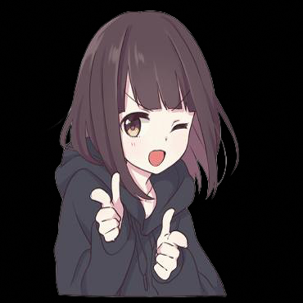
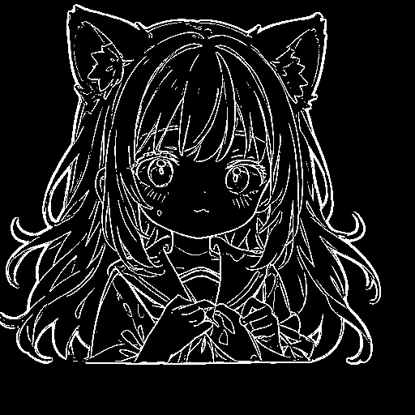
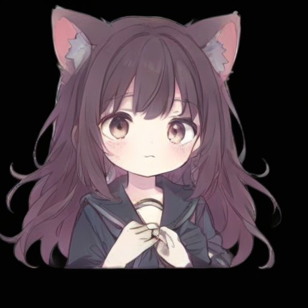

title: Stable Diffusion Reference Only
emoji:🔥
colorFrom: indigo
colorTo: pink
sdk: gradio
sdk_version: 3.1.4
app_file: app.py
pinned: false
license: apache-2.0
models:
- AisingioroHao0/stable-diffusion-reference-only-automatic-coloring-0.1.2

# StableDiffusionReferenceOnly

A general model for secondary creation.

No training is needed to achieve style transfer of any anime character and line drawing coloring.

Code: https://github.com/aihao2000/StableDiffusionReferenceOnly

Model: https://huggingface.co/AisingioroHao0/stable-diffusion-reference-only-automatic-coloring-0.1.2

|               prompt                |               blueprint                |               result                |
| :---------------------------------: | :------------------------------------: | :---------------------------------: |
|  |  |  |


### Instructions

Secondary creation requires two images.

One is prompt image. It is a reference image that you wish to migrate to the new image. We provide the ```character segment``` function to clear the background, which often brings better results.

The other is blueprint image. It will control the picture structure of the new picture. It is also recommended to use ```character segment``` to enhance the effect. And there are two other buttons. If the blueprint you input is manual line drawing, you only need to click the ```color inversion``` button to ensure a black background and white lines. If you are entering a color image of another character, you need to click the ```get line art``` button and then click the ```color inversion``` button. Then click the inference button to get the results. 


You can also directly upload reference images and line art image and click ```automatic coloring``` to get the results without the above operations.

You can also directly upload two color character pictures to try ```style transfer```

## 介绍

二次创作需要两张图片。

一是提示图像。 它是您希望迁移到新图像的参考图像。 我们提供了角色分割```character segment```功能来清除背景，这往往会带来更好的效果。

另一种是蓝图图像。 它将控制新图片的图片结构。还建议使用```character segment```来增强效果。 还有另外两个按钮。 如果您输入的图纸是人工线稿，则只需点击```color inversion```按钮即可保证黑底白线。 如果您要输入另一个角色的彩色图像，则需要单击```get line art```按钮，然后单击```color inversion```按钮。 然后点击```inference```按钮即可得到结果。


您也可以直接上传参考图和线稿图，点击```automatic coloring```即可得到结果，无需进行上述操作。

也可以直接上传两张彩色人物图片来试试风格迁移```style transfer```。

## meta data


